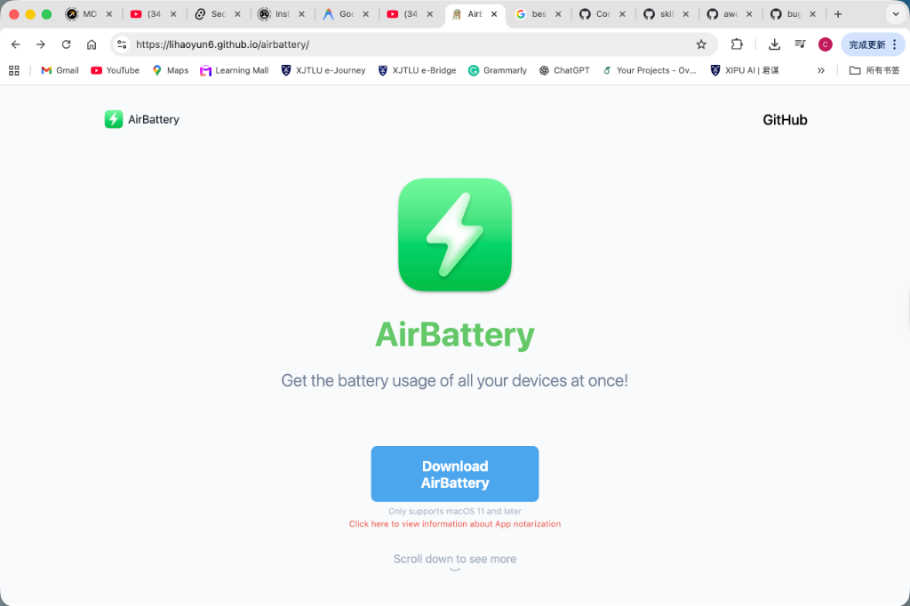
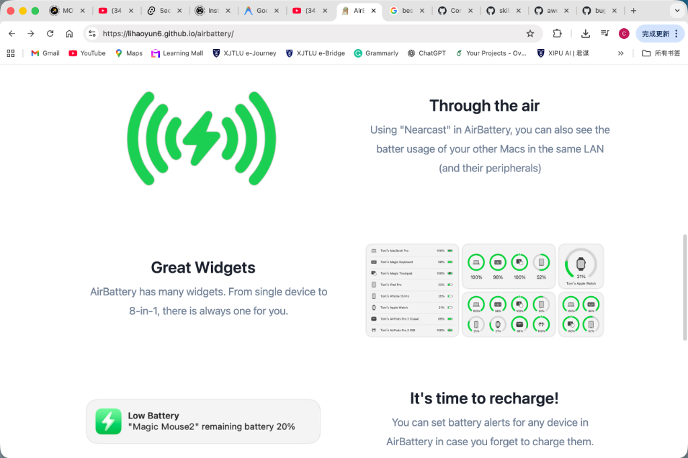

# Design Inspiration Guide

This document provides **design inspiration** from real-world examples. These are meant to demonstrate design principles and patterns, not to be copied exactly. Good design adapts these patterns to work with your specific app's brand and content.

> **Important**: Don't copy these designs exactly. Instead, understand the **principles** behind them and apply those to create something unique for your app.

## Design Inspiration Sources

Great landing page design inspiration can be found at:

- **Apple.com** - The gold standard for minimalist, product-focused design
- **Dribbble** - Search "app landing page" for diverse modern styles
- **Land-book.com** - Curated landing page gallery
- **One Page Love** - Single page website inspiration
- **Awwwards** - Award-winning web design
- **SaaS Landing Page** - Specifically for software products

## Inspiration Example 1: Centered Hero



### What Makes This Work

| Element | Why It Works | Adapt It |
|---------|--------------|----------|
| **Centered layout** | Creates focus, symmetry feels premium | Keep centering, adjust spacing |
| **Large app icon** | Immediate brand recognition | Use your own icon at 96-128px |
| **Simple tagline** | One sentence explains value | Write your own tagline |
| **Single CTA** | No decision paralysis | Use your primary action |
| **Subtle meta** | Platform info without distraction | Show your requirements |

### Principles to Extract

1. **Simplicity** - One element at a time, vertical flow
2. **Breathing room** - Generous whitespace around icon
3. **Hierarchy** - Icon → Name → Tagline → CTA → Meta
4. **Color restraint** - Icon provides color, rest is neutral

### How to Adapt (Don't Copy)

- **Different color scheme** - Use your app's brand colors
- **Different icon style** - Your icon, your shape
- **Different typography** - Choose fonts that match your brand
- **Different spacing** - Adjust based on content length
- **Different CTAs** - Your specific actions (App Store, GitHub, etc.)

---

## Inspiration Example 2: Alternating Features



### What Makes This Work

| Element | Why It Works | Adapt It |
|---------|--------------|----------|
| **Alternating layout** | Guides the eye, creates rhythm | Keep zig-zag, change content |
| **Large illustrations** | Visual interest, explain features | Use screenshots or your own graphics |
| **Short headlines** | Scannable, memorable | Write your own feature names |
| **Brief description** | Enough to understand, not overwhelming | Explain your features |
| **Widget showcase** | Real product demonstration | Show your actual UI |

### Principles to Extract

1. **Visual variety** - Alternate directions keep engagement
2. **Image-text balance** - Neither dominates, both support
3. **Whitespace rhythm** - Consistent gaps between sections
4. **Feature prioritization** - Most important features first

### How to Adapt (Don't Copy)

- **Use your own screenshots** - Not generic illustrations
- **Different feature count** - 3-5 key features
- **Different visual style** - Match your brand aesthetics
- **Different animations** - Unique entrance effects
- **Different grid** - Maybe cards instead of alternating

---

## Pattern Library (Abstract Patterns)

These are abstract patterns, not specific designs to copy:

### Pattern A: Hero Layouts

```
1. CENTERED
   [Icon]
   [Name]
   [Tagline]
   [CTA]
   
2. SPLIT (Left Content, Right Image)
   [Icon] ............ [Screenshot]
   [Name] ............ [Screenshot]
   [Tagline] ......... [Screenshot]
   [CTA] ............. [Screenshot]
   
3. FULL-WIDTH (Background Image)
   ╔══════════════════════════════════╗
   ║  [Dark Overlay]                  ║
   ║     [Content Centered on Image]  ║
   ╚══════════════════════════════════╝
```

### Pattern B: Feature Layouts

```
1. ALTERNATING (Zig-zag)
   [Image] .... [Text]
   [Text] ..... [Image]
   [Image] .... [Text]
   
2. GRID (Cards)
   [Card] [Card] [Card]
   [Card] [Card] [Card]
   
3. BENTO (Asymmetric)
   [Large Card] [Small]
   [Large Card] [Small]
   [Medium] [Medium]
```

### Pattern C: CTA Layouts

```
1. CENTERED SIMPLE
   [Heading]
   [Button]
   [Meta info]
   
2. WITH STEPS
   [Heading]
   [Step 1] [Step 2] [Step 3]
   [Button]
   
3. DUAL ACTION
   [Primary Button] [Secondary Button]
```

---

## Creating Your Own Style

### Step 1: Study Multiple References

Don't just look at one design. Study 5-10 designs you like and identify:
- What do they have in common?
- What makes each one unique?
- Which patterns fit your content?

### Step 2: Extract Principles

From your research, list principles like:
- "I like generous whitespace"
- "I prefer centered layouts"
- "I want subtle animations"

### Step 3: Apply to Your Content

With principles in hand:
1. Start with your app's specific content
2. Apply the layout patterns
3. Use your brand colors and typography
4. Adjust spacing to fit your content
5. Add your own creative touches

### Step 4: Iterate

First version won't be perfect. Iterate:
- Try different layouts
- Adjust proportions
- Get feedback
- Refine details

---

## Avoiding Overfitting

> **Overfitting**: When a design works for one specific case but doesn't generalize.

### Signs of Overfitting

- ❌ Copying exact pixel values
- ❌ Using the same illustrations
- ❌ Replicating the exact color scheme
- ❌ Same layout for different content lengths

### How to Generalize

- ✅ Understand *why* a design decision works
- ✅ Create *systems* (color scales, spacing scales)
- ✅ Design for *your content*, not the reference's content
- ✅ Add your own *personality* and brand elements
- ✅ Test with *different content* to ensure flexibility

---

## Design Resources

### Free Assets

- **Unsplash** - High-quality photos
- **Undraw** - Open-source illustrations
- **Heroicons** - SVG icons
- **Lucide** - Icon library

### Color Tools

- **Coolors** - Color palette generator
- **UI Colors** - TailwindCSS color scale generator
- **ColorHunt** - Curated color palettes

### Typography

- **Google Fonts** - Free web fonts (Inter, Outfit, Poppins)
- **Fontpair** - Font pairing suggestions

### Mockup Tools

- **Figma** - Design and prototype
- **Rotato** - 3D device mockups
