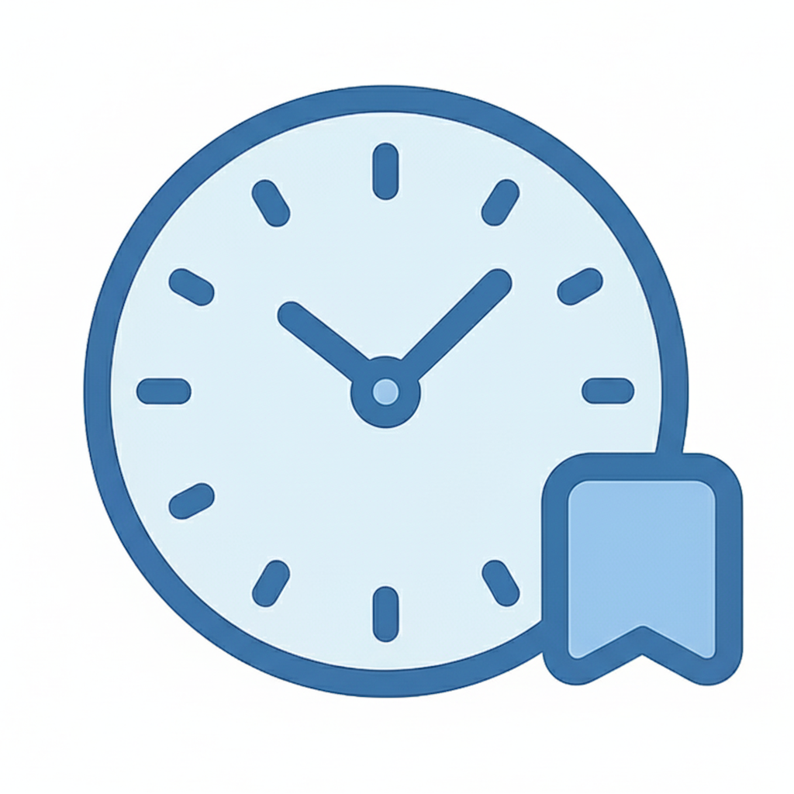

# TimeBar App Analysis Report

> Generated: 2026-01-16
> Source: [GitHub Repository](https://github.com/bugsmachine/TimeBar) + Local Source Code

---

## 📱 App Overview

**TimeBar** is a lightweight, elegant macOS menu bar application for tracking time zones of colleagues, family, and friends around the world.

| Field | Value |
|-------|-------|
| **Name** | TimeBar |
| **Tagline** | Elegantly display additional time zones in your macOS menu bar |
| **Version** | 1.0.0 |
| **Author** | bugsmachine (A student passionate about macOS development) |
| **License** | CC BY-NC-SA 4.0 |

---

## 🎨 Brand Colors

Based on the app icon analysis, the following color palette was extracted:

| Color | Hex Code | Usage |
|-------|----------|-------|
| **Primary** | `#4A7EB5` | Clock outline (dark blue) |
| **Primary Light** | `#8AB4E8` | Bookmark/ribbon element |
| **Primary Dark** | `#3D6A9A` | Darker blue for depth |
| **Accent** | `#5C91C7` | Accent blue |
| **Background** | `#ECF5FF` | Light blue clock face |
| **Dark BG (suggested)** | `#1A2B3C` | Dark mode background |

---

## ✨ Features

| Emoji | Feature | Description |
|-------|---------|-------------|
| 🌍 | **Multiple Time Zones** | Display additional time zones directly in your menu bar |
| 🚩 | **Country Flags** | Visual indicators for quick country/region identification |
| ⏱️ | **Time Difference** | See timezone offset without doing math |
| 🌐 | **Multi-Language** | English, Simplified Chinese, Traditional Chinese |
| ⚙️ | **Highly Customizable** | Drag-and-drop reordering, custom names |
| 🔄 | **Auto Updates** | Built-in Sparkle framework updates |
| 💡 | **Lightweight** | Minimal resource usage |
| 🔒 | **Privacy First** | Open source and offline-first |

---

## 🛠️ Tech Stack

| Component | Technology |
|-----------|------------|
| **Language** | Swift |
| **UI Framework** | SwiftUI |
| **Platform** | macOS |
| **Min Version** | 14.1 (Sonoma) |
| **Frameworks** | AppKit, Sparkle, Combine |

---

## 📋 System Requirements

- **macOS 14.1** (Sonoma) or later
- Apple Silicon or Intel Mac

---

## 📥 Download

- **GitHub Releases**: https://github.com/bugsmachine/TimeBar/releases
- **App Store**: Not available (unsigned)

---

## 🌐 Languages Supported

- 🇺🇸 English
- 🇨🇳 简体中文 (Simplified Chinese)
- 🇹🇼 繁體中文 (Traditional Chinese)

---

## 📁 Generated Assets

| File | Description |
|------|-------------|
| `app-profile.yaml` | Complete app profile for landing page generation |
| `AppIcon.png` | High-resolution app icon (1024x1024) |
| `TimeBarIcon-T.png` | Transparent background version of the icon |

---

## 🚀 Next Steps

This app profile is ready to be used with:
1. **premium-ui-design** skill - for color palette and design decisions
2. **react-landing-page** skill - for content population and landing page creation

To create a landing page, use the `react-landing-page` skill with the generated `app-profile.yaml`.
